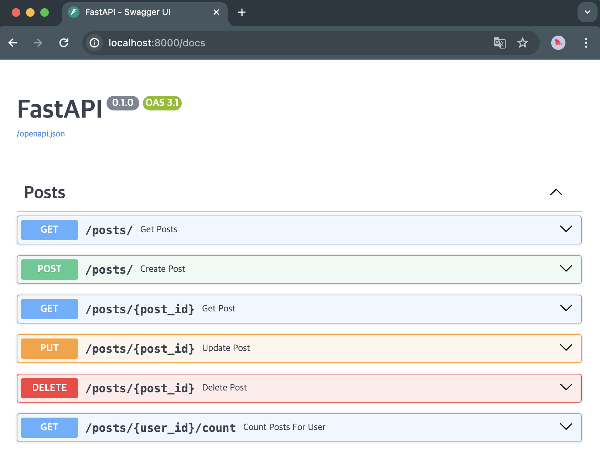

# FastAPI Excercise

RESTful API with FastAPI to provide access to the mongo data

### Start

```bash
docker-compose up
```

During the process command run python script at `scripts/fetch_fake_data.py` this script fetch and store `posts`,`comments` data from JSONPlaceholder - Free Fake REST API.

Once this finishes you can navigate to `localhost:8000`

```json
{
  "message": "API Development Exercise"
}
```

The backend docs will be at `http://localhost:8000/docs`


### Details for feature

1. Posts

Data structure of `posts_collection`

```json
{
  "_id": "665634e18d58f4905eb70edb",
  "userId": 1,
  "id": 1,
  "title": "example title",
  "body": "example body"
}
```

Api contains following features:

- Retrieve entire posts (Optionally, you can filter comments by `userId`, `search param`- title and contents)
- Retrieve a specific post by `id`(unique identifier for the document)
- Create new post
- Update title and body of existing post
- Delete post
- Count the number of posts for a selected user

2. Comments

Data structure of `comments_collection`

```json
{
  "_id": "665634e28d58f4905eb70f3f",
  "postId": 1,
  "id": 1,
  "name": "name",
  "email": "Eliseo@gardner.biz",
  "body": "example body"
}
```

Api contains following features:

- Retrieve entire comments (Optionally you can filter comments by `postId`)
- Retrieve a specific post by `id`(unique identifier for the document)
- Create new comment
- Update body(content) of existing comment
- Delete comment
- Count the number of comments for a selected user by email
